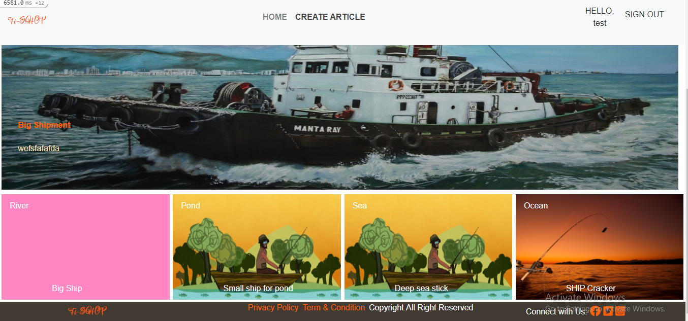
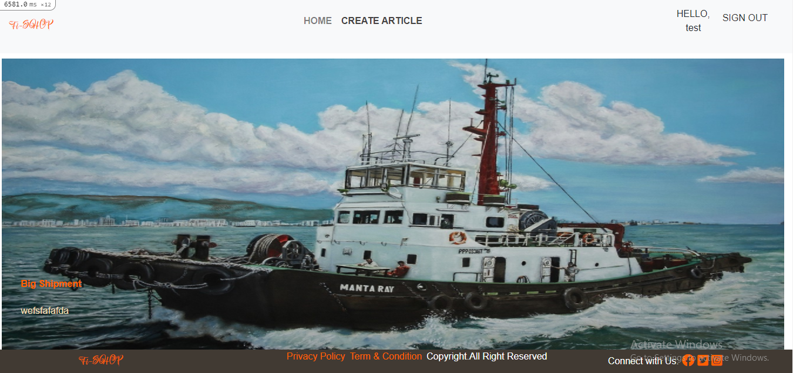
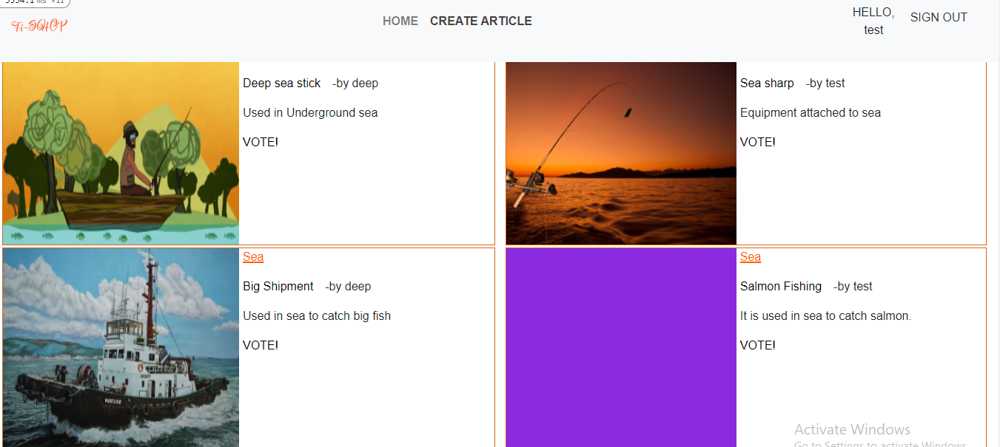
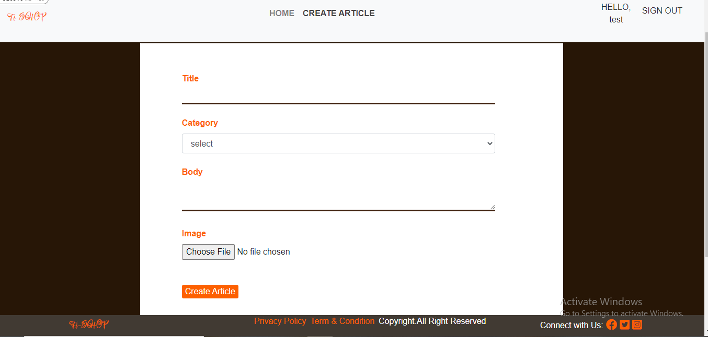
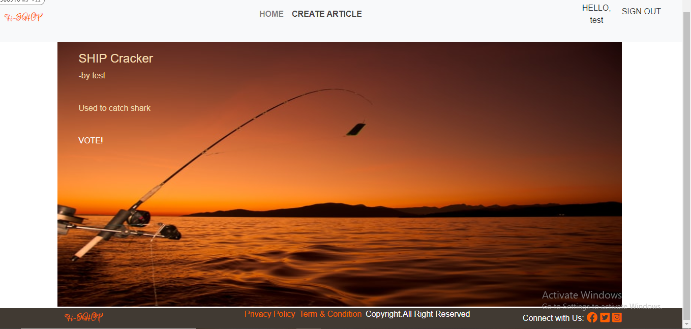
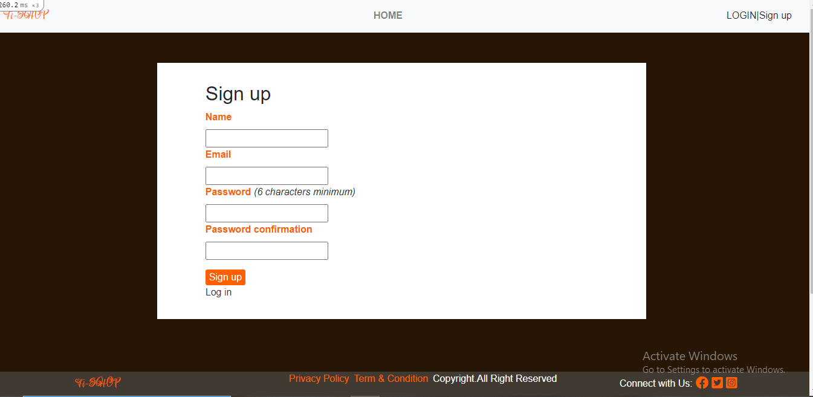
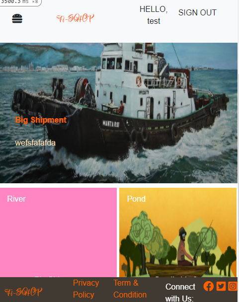

# Fi-Shop
A Websites to see a different kind of fishing equipment used in different types of places like River, pond, Sea, etc. Here Article can be created. You can vote for any article of your choice and it is displayed on the home page if it has a maximum vote. The article is also divided into categories. Thanks.

## Deployment
- Heroku Link: [Click here]()








## Getting started

To get started with the website, first clone the repo and `cd` into the directory:

```
$ git clone https://github.com/Deepakdanger/fishing_app.git
$ cd fishing_app
```
on:
  # Triggers the workflow on push or pull request events but only for the development branch
  push:
    branches: [ development ]
  pull_request:
    branches: [ development ]

Then install the needed packages (while skipping any Ruby gems needed only in production):

```
$ bundle install
```

Next, setup webpacker configuration

```
$ rails webpacker:install
```

After that, create and migrate the database:

```
$ rails db:create
$ rails db:migrate
```

To run the project on rails local server:

```
$ rails server
```
## Deploying

you’ll need a Heroku account

To deploy this, you’ll need to create a new Heroku application, switch to the right branch, push up the source, run the migrations, and seed the database with sample users:

```
$ heroku create
$ git checkout feature
$ git push heroku feature:master
$ heroku run rails db:migrate
$ heroku run rails db:seed
```

Visiting the URL returned by the original `heroku create` should now show you the sample website running in production. 

## Branches

Simply check out the corresponding branch using `git checkout`:

```
$ git checkout <branch name>
```

## Authors

👤 **Deepak Kumar**
- GitHub: [@githubhandle](https://github.com/Deepakdanger)


## Contributions
Design from [Gregoire Vella](https://www.behance.net/sakwadesignstudio)